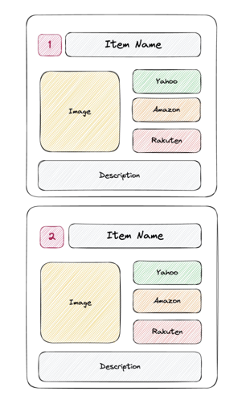

# uBlacklist-rankings

## Synopsis

Exclude domains serving useless "Top N ..."-ish contents that
only provide brief description of things and affiliate links.

This list can be subscribed by [uBlacklist](https://github.com/iorate/uBlacklist),
a browser extension available for Google Chrome, Firefox, Safari and others.

## Example of "Top N" contents

## Usage

1. Install uBlacklist
   - [Chrome Web Store](https://chrome.google.com/webstore/detail/ublacklist/pncfbmialoiaghdehhbnbhkkgmjanfhe)
   - [Firefox Add-ons](https://addons.mozilla.org/en-US/firefox/addon/ublacklist/)
   - [Apple App Store](https://apps.apple.com/jp/app/ublacklist-for-safari/id1547912640)

2. Open the uBlacklist configuration, and then click "Add a subscription"

3. Add `https://raw.githubusercontent.com/exoego/ublacklist-rankings/master/uBlacklist.txt` in the dialog.

## Acknowledgements

- [irotate/uBlacklist](https://github.com/iorate/uBlacklist) for the exceptional browser extension
- [arosh/ublacklist-stackoverflow-translation](https://github.com/arosh/ublacklist-stackoverflow-translation) for the base source
- [twitter @azu_re](https://twitter.com/azu_re/status/1608974655104380928) for the original idea

## License

[Creative Commons Zero v1.0 Universal](LICENSE)
